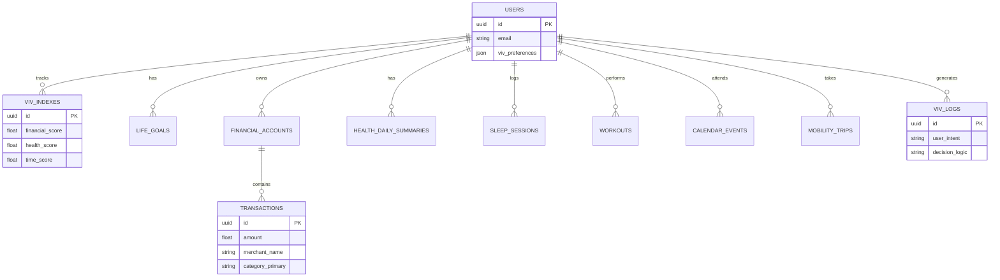

# Database Schema

## Overview
The application uses a relational database (SQLite for dev, PostgreSQL for prod) with SQLAlchemy ORM. The schema is designed to be "Enterprise-Grade" and "Deep-Context" to support the "Viv" logic engine, capturing detailed metadata for every event (Time, Location, Context, Category).

## Tables

### 1. Core User & Logic Layer
Stores the "State" of the user and their long-term targets.

- **`users`**
  - `id` (PK): UUID
  - `email`: String
  - `hashed_password`: String
  - `profile_json`: JSON (Unstructured bio data)
  - `viv_preferences`: JSON (Risk tolerance, communication style, conflict resolution mode)
  - `created_at`: DateTime

- **`viv_indexes`** (Time-series tracking of the 3 tenants)
  - `id` (PK): UUID
  - `user_id` (FK): UUID
  - `timestamp`: DateTime
  - `financial_score`: Float (0-100)
  - `health_score`: Float (0-100)
  - `time_score`: Float (0-100)
  - `snapshot_reason`: Text (Why the score changed)

- **`life_goals`** (Crucial for decision making)
  - `id` (PK): UUID
  - `user_id` (FK): UUID
  - `title`: String
  - `target_amount`: Float
  - `saved_amount`: Float
  - `deadline`: DateTime
  - `impact_vector_json`: JSON ({"finance": -100, "health": +20})
  - `priority`: Enum ("high", "medium", "low")

### 2. Deep Finance (The "Wealth" Tenant)
Captures WHO the merchant is, WHAT category it is, and IF it is recurring.

- **`financial_accounts`**
  - `id` (PK): UUID
  - `user_id` (FK): UUID
  - `institution_name`: String
  - `account_type`: String (checking, savings, credit)
  - `current_balance`: Float
  - `limit`: Float

- **`transactions`** (The Deep Dive)
  - `id` (PK): UUID
  - `account_id` (FK): UUID
  - `user_id` (FK): UUID
  - `amount`: Float
  - `currency_code`: String
  - `transaction_date`: DateTime
  - `merchant_name`: String
  - `merchant_category_code`: String
  - `category_primary`: String
  - `category_detailed`: String
  - `is_recurring`: Boolean
  - `location_lat`: Float
  - `location_lon`: Float

### 3. Deep Health (The "Wellbeing" Tenant)
Distinguishes between "good tired" and "bad tired".

- **`health_daily_summaries`**
  - `user_id` (FK): UUID
  - `date`: Date
  - `sleep_duration_minutes`: Integer
  - `sleep_quality_score`: Float (0-100)
  - `hrv_average`: Float
  - `resting_heart_rate`: Integer
  - `steps_count`: Integer

- **`sleep_sessions`**
  - `id` (PK): UUID
  - `user_id` (FK): UUID
  - `start_time`: DateTime
  - `end_time`: DateTime
  - `deep_sleep_minutes`: Integer
  - `rem_sleep_minutes`: Integer
  - `wake_count`: Integer

- **`workouts`**
  - `id` (PK): UUID
  - `user_id` (FK): UUID
  - `start_time`: DateTime
  - `end_time`: DateTime
  - `activity_type`: String
  - `calories_burned`: Integer
  - `average_heart_rate`: Integer
  - `perceived_exertion`: Float (0-10)

### 4. Deep Time & Mobility (The "Productivity" Tenant)
Understands the "Cost of Time" and "Context of Location".

- **`calendar_events`**
  - `id` (PK): UUID
  - `user_id` (FK): UUID
  - `start_time`: DateTime
  - `end_time`: DateTime
  - `title`: String
  - `is_meeting`: Boolean
  - `attendee_count`: Integer
  - `location_context`: Enum ("wfh", "office", "traveling")

- **`mobility_trips`**
  - `id` (PK): UUID
  - `user_id` (FK): UUID
  - `provider`: String
  - `pickup_time`: DateTime
  - `dropoff_time`: DateTime
  - `cost_amount`: Float
  - `currency`: String
  - `trip_type`: Enum ("economy", "premium")
  - `origin_lat`: Float
  - `origin_lon`: Float
  - `destination_lat`: Float
  - `destination_lon`: Float

### 5. Intelligence Layer (The Audit Trail)
Tracks WHY Viv gave specific advice.

- **`viv_logs`**
  - `id` (PK): UUID
  - `user_id` (FK): UUID
  - `timestamp`: DateTime
  - `user_intent`: String
  - `context_snapshot_json`: JSON (Exact values of Finance/Health/Time at decision moment)
  - `decision_logic`: String
  - `ai_response`: Text

## Diagram

